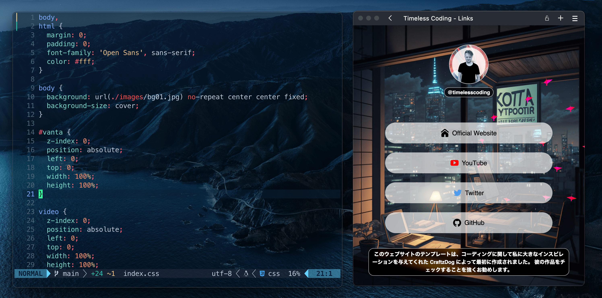

# Link-in-bio for timelesscoding

https://links.raivis.work/

[Video tutorial available here](https://youtu.be/u71pHOyvBp0).

## License

MIT by Takuya Matsuyama

You can create your own link-in-bio page for free without notifying me by forking this project under the following conditions:

- Add a link to [my homepage](https://www.craftz.dog/) anywhere
- Do not use the Japanese garden picture

Additional notes by Raivis Gereiss

- The link has been added
- The garden picture has swapped with another background picture
